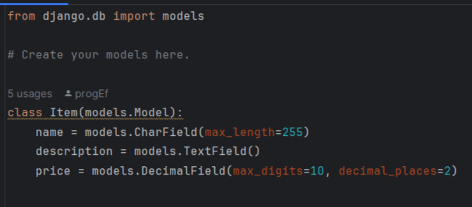

# Зависимости

Для запуска Django проекта требуется: Python >=3.10
### Установка зависимостей
```sh
pip install -r requirements.txt
```
### Запуск проекта
```sh
python manage.py runserver 
```

# Структура проекта 
```sh
PracticalTaskForUniCo/
├── APIStripe/ 
│   ├── migrations/
│   ├── init.py
│   ├── admin.py
│   ├── apps.py
│   ├── models.py
│   ├── tests.py
│   └── views.py
├── core/
│   ├── init.py
│   ├── asgi.py
│   ├── settings.py
│   ├── urls.py
│   └── wsgi.py
├── images/
│   └── models.png
├── templates/
│   ├── home.html
│   └── product.html
├── .gitignore
├── db.sqlite3
├── manage.py
├── README.md
└── requirements.txt
```

### Модель Item

Модель Item содержит следующие поля:



- **name** (CharField): Название товара. Максимальная длина — 255 символов.
  
- **description** (TextField): Подробное описание товара. Это поле позволяет вводить текст произвольной длины.

- **price** (DecimalField): Цена товара. Это поле хранит числовое значение с максимальным количеством цифр 10 и двумя знаками после запятой (например, 99999999.99).


### Примечания