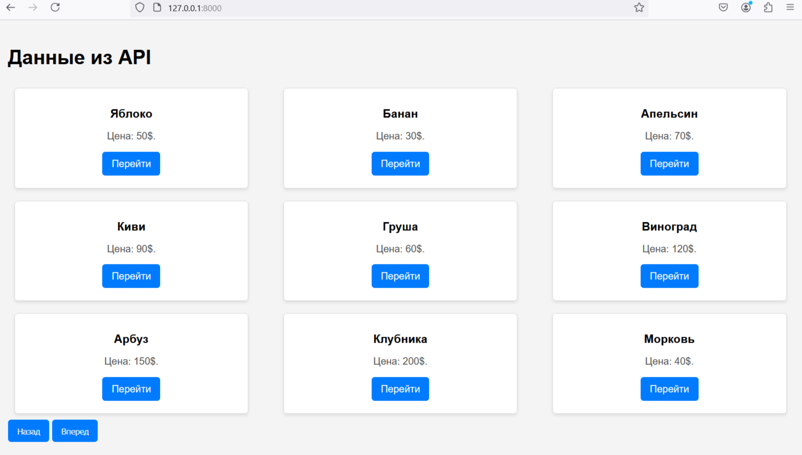

# Зависимости

Для запуска Django проекта требуется: Python >=3.10
### Установка зависимостей
```sh
pip install -r requirements.txt
```
### Запуск проекта
```sh
python manage.py runserver 
```

# Структура проекта 
```sh
PracticalTaskForUniCo/
├── APIStripe/ 
│   ├── migrations/
│   ├── init.py
│   ├── admin.py
│   ├── apps.py
│   ├── models.py
│   ├── tests.py
│   └── views.py
├── core/
│   ├── init.py
│   ├── asgi.py
│   ├── settings.py
│   ├── urls.py
│   └── wsgi.py
├── images/
│   └── models.png
├── templates/
│   ├── home.html
│   └── product.html
├── .gitignore
├── db.sqlite3
├── manage.py
├── README.md
└── requirements.txt
```

### Модель Item

Модель Item содержит следующие поля:


- **name** (CharField): Название товара. Максимальная длина — 255 символов.
  
- **description** (TextField): Подробное описание товара. Это поле позволяет вводить текст произвольной длины.

- **price** (DecimalField): Цена товара. Это поле хранит числовое значение с максимальным количеством цифр 10 и двумя знаками после запятой (например, 99999999.99).


### core\urls.py
```sh
    path('admin/', admin.site.urls),
    path('', products_home, name='home'), # Home page
    path('buy/<int:id>/', BuyView.as_view(), name='buy_item'), # API for buy
    path('item/<int:id>/', item_detail, name='item_detail'), #Item page
    path('page/', AllProducts.as_view(), name='item_count'), # API all products
```
### Главная страница:
<button onclick="document.getElementById('image').style.display='block'">Показать изображение</button>

### APIStripe\views.py
Путь к html
```sh
def products_home(request): # home page
    return render(request, 'home.html')
```
Api 
```sh
class AllProducts(APIView):# page/
    def get(self, request):
        paginator = PageNumberPagination()# Создаем экземпляр пагинатора
        paginator.page_size = 9  #  размер страницы
        items = Item.objects.values('id', 'name', 'price')  #выбираем  необходимые поля
        paginated_items = paginator.paginate_queryset(items, request) # Пагинируем запрос, используя переданные параметры из запроса

        return paginator.get_paginated_response(paginated_items)
```