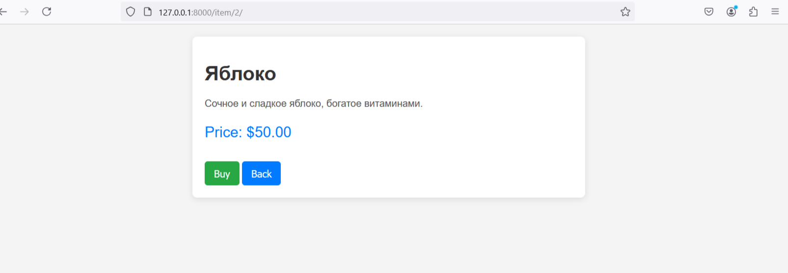

# Зависимости

Для запуска Django проекта требуется: Python >=3.10
### Установка зависимостей
```sh
pip install -r requirements.txt
```
### Запуск проекта
```sh
python manage.py runserver 
```

# Структура проекта 
```sh
PracticalTaskForUniCo/
├── APIStripe/ 
│   ├── migrations/
│   ├── init.py
│   ├── admin.py
│   ├── apps.py
│   ├── models.py
│   ├── tests.py
│   └── views.py
├── core/
│   ├── init.py
│   ├── asgi.py
│   ├── settings.py
│   ├── urls.py
│   └── wsgi.py
├── images/
│   └── models.png
├── templates/
│   ├── home.html
│   └── product.html
├── .gitignore
├── db.sqlite3
├── manage.py
├── README.md
└── requirements.txt
```

### Модель Item

Модель Item содержит следующие поля:


- **name** (CharField): Название товара. Максимальная длина — 255 символов.
  
- **description** (TextField): Подробное описание товара. Это поле позволяет вводить текст произвольной длины.

- **price** (DecimalField): Цена товара. Это поле хранит числовое значение с максимальным количеством цифр 10 и двумя знаками после запятой (например, 99999999.99).


### core\urls.py
```sh
    path('admin/', admin.site.urls),
    path('', products_home, name='home'), # Home page
    path('buy/<int:id>/', BuyView.as_view(), name='buy_item'), # API for buy
    path('item/<int:id>/', item_detail, name='item_detail'), #Item page
    path('page/', AllProducts.as_view(), name='item_count'), # API all products
```

# APIStripe\views.py
### Путь к html:
```sh
def products_home(request): # home page
    return render(request, 'home.html')
```
### Главная страница:


### Api /page/ 
Этот код создает API для получения списка товаров с пагинацией:

```sh
class AllProducts(APIView):# page/
    def get(self, request):
        paginator = PageNumberPagination()# Создаем экземпляр пагинатора
        paginator.page_size = 9  #  размер страницы
        items = Item.objects.values('id', 'name', 'price')  #выбираем  необходимые поля
        paginated_items = paginator.paginate_queryset(items, request) # Пагинируем запрос, используя переданные параметры из запроса

        return paginator.get_paginated_response(paginated_items)
```

Ответ представлен в формате JSON и имеет статус 200 "ОК". Основная схема ответа выглядит следующим образом:
```sh
{
    "type": "object",
    "properties": {
        "count": {
            "type": "integer"
        },
        "next": {
            "type": "string"
        },
        "previous": {
            "type": "string"
        },
        "results": {
            "type": "array",
            "items": {
                "type": "object",
                "properties": {
                    "id": {
                        "type": "integer"
                    },
                    "name": {
                        "type": "string"
                    },
                    "price": {
                        "type": "integer"
                    }
                }
            }
        }
    }
}
```
### Путь к html:
url: /item/id продукта/ 
```sh
def item_detail(request, id): #
    item = get_object_or_404(Item, id=id) # Пытаемся получить объект Item по указанному id; если не найден, возвращаем 404
    return render(request, 'product.html', {'item': item})
```
### Cтраница продукта:


### Api '/buy/id продукта/' 
 API-эндпоинт для оформления покупки товара по его идентификатору который создает сессию оформления заказа с помощью Stripe:
```sh
class BuyView(APIView):  # GET /buy/{id}:
    def get(self, request, id):
        host = request.get_host()

        try:
            # Получение товара по идентификатору
            product = Item.objects.get(id=id)

            # Создание сессии оформления заказа
            session = stripe.checkout.Session.create(
                payment_method_types=['card'],
                line_items=[
                    {
                        'price_data': {
                            'currency': 'usd',
                            'product_data': {
                                'name': product.name,
                            },
                            'unit_amount': int(product.price * 100),
                        },
                        'quantity': 1,
                    },
                ],
                mode='payment',
                success_url=f'http://{host}/',
                cancel_url=f'http://{host}/',
            )

            return JsonResponse({'sessionId': session.id})
        except Item.DoesNotExist:
            return JsonResponse({'error': 'Product not found'}, status=404)
        except Exception as e:
            return JsonResponse({'error': str(e)}, status=500)
```
### Request:
Method: GET     
URL: http://127.0.0.1:8000/buy/2
### Response
```sh
{
    "sessionId": "string"
}
```